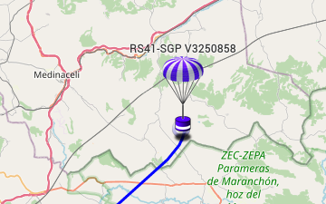
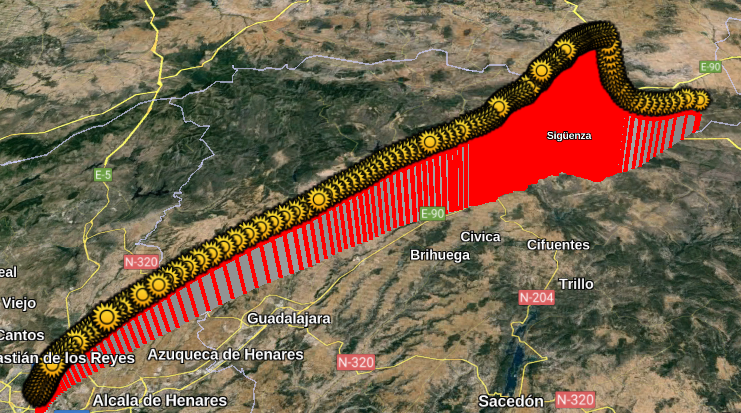
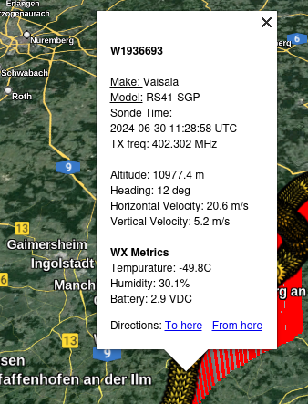

# SondeHub_json2kml_v3-4
## Script to convert radiosonde json from sondehub.org into kml

*Updated* v3-4 - updated info box output for Google Earth; added local time conversion
Caveat:  Time conversion is based on CMOS timezone information from the system running the script, not local to the launch.
If one reads the 'local time' for a sonde in Britain from a Canadian locale, the 'local time' will be Canadian local.
Time conversion is hard. 

### Usage:
1) Navigate to sondehub.org
2) Find a radiosonde of interest (current or past); copy radiosonde serial
    #### Format
    U, V, X, or W####### (sometimes without the U, V, or W)
    #### Example
    V3250858
   


4) Run scrpit as follows:
```
>python3 SondeHub_json2kml_v3-2.py <radiosonde serial>
```
4) A kml file will be saved to the current user directory
5) Open the kml file in Google Earth




**NOTE**: This is a visualization of radio packets recieved by the ground stations from a radiosonde and may not be all packets or have duplicates.  I had a free day and decided to dust off my python; use at your convenience and beware of your surroundings. 

**_I am not responsible for any detrimental actions from using this script!_**

Enjoy and modify as needed.

### Credits
To Patrick Eisoldt for creating the simplekml module for python (https://pypi.org/project/simplekml)

and

To d-me3 for dev'ing the json2kml script (https://github.com/d-me3/json2kml)

Finally,

Thanks to SondeHub.org for putting together such a great tool.
